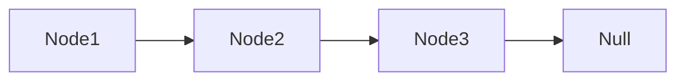
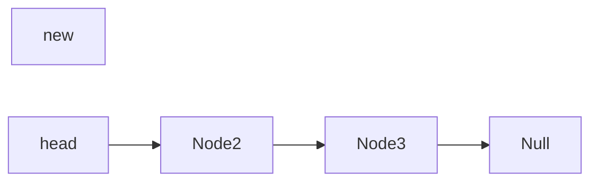
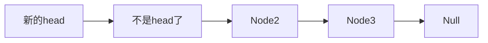
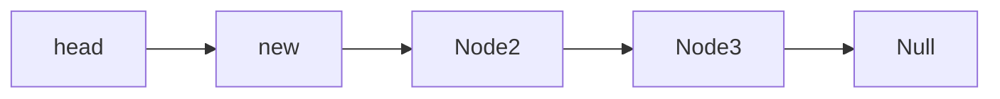

## 4.1 链表 Linked List

​	前面学习的栈和列表的动态结构的底层都是依托的静态数组，靠resize解决固定容量问题。而链表是真正的一种动态数据结构。而且是最简单的动态数据结构（和后面的树、二叉树、红黑树等相比）。

​	链表涉及到了更深入的引用问题（在C中就是所谓的指针）。对链表这种数据结构有深入的理解，有助于更好的理解引用、指针和==递归==等。递归机制对后面的树、图等的理解是很有用的。

​	树、图、栈、队列都可以用链表作为底层进行实现。

#### 4.1.1 链表结构

​	把数据存储到一个单独的结构中，称为 “节点” （Node）。

​	节点包括两部分内容：真正的数据和当前节点指向的下一个节点。节点数不可能是无尽的，所以最后一个next存储的节点就是Null。

```java
class Node {
    E e;
    Node next;
}
```



​	**优点**：

​	真正的动态，不需要处理固定容量的问题。

​	**缺点**：

​	丧失了随机访问的能力，也就是不能根据下标去直接访问某个元素。因为像**数组**那种在内存中开辟的存储空间是**连续**的，根据索引值和偏移量直接就能得到下面的元素。而**链表**的节点元素是通过next一个一个连接的，所以节点之间的存储**不一定是连续**的，而是在哪里都可以的。

## 4.2 链表实现

#### 4.2.1 添加元素

​	之前学习的数组、栈、队列都是从后端添加新元素容易实现，因为size一般指向下一个元素的位置，直接找到size对应位置赋值就好了。但是链表是==从头上==添加新元素容易实现，因为链表没有所谓的下标可以找到某个元素，所以要找到最后一个元素需要从第一个元素开始找，直到最后一个元素！



在**头部**添加新的元素，head指向新元素，新元素的next指向之前的head。



```java
/**
 * 从头上添加新元素
 * @param e
 */
public void addFirst(E e){
    head = new Node(e, head);
    size ++;
}
```

在**中间**添加新的元素，比如在Node2前面添加新的元素。

​	这就需要找到新节点插入位置之前的节点是谁，定义prev指向前面的那个节点（Node1/head），前面节点的next指向新节点，新节点的next指向插入位置的原节点（Node2）。注意这个顺序是不可以变的！

​	找prev指向的节点时，要从head开始往后找，所以先定义Node prev = head;  然后遍历下标，直到下标到要插入下标位置的前一个位置停止。比如说：index = 3, 从i = 0开始到i = 1为止（遍历两次）。



​	但是还有一个**问题**：如果要在第一个位置那插入新元素时，是没有前一个元素的，这种情况下就需要特殊处理一下。

```java
/**
 * 从任意位置添加元素 O(n)
 * @param index 插入位置是以0开始的，所以如果输入为0说明插入到头上，输入为2说明插入到第三个位置
 * @param e
 */
public void add(int index, E e){
    if(index < 0 || index > size){
        throw new IllegalArgumentException("Add Failed! Illegal index");
    }
    if(index == 0){
        addFirst(e);
    }else{
        //找到插入元素的前一个节点
        Node pre = head;
        for(int i = 0; i < index - 1; i ++){
            pre = pre.next;
        }
        pre.next = new Node(e, pre.next);
        size ++;
    }
}

/**
  * 从头上添加新元素 O（1）
  * @param e
  */
public void addFirst(E e){
     add(0, e);
}

/**
 * 从末尾添加元素  O（n）
 * @param e
 */
public void addLast(E e){
    add(size, e);
}
```

#### 4.2.2 使用链表的虚拟头结点

​	在4.2.1中实现添加元素的时候，在任意位置添加元素的时候，需要对在头部位置添加元素进行一下特别处理，因为头部之前没有结点了，为了使的添加元素的实现满足逻辑上的一致性，在实际的头部前面再加上一个虚拟头结点（null，head）。**这种做法就像前面循环队列中留有一个空位置**，都是为了满足更好的逻辑实现。

```java
    /**
     * 空构造函数
     */
    public LinkedList(){
        dummyHead = new Node(null, null); //不是空，是空结点
        size = 0; //虚拟头结点，不算入实际结点数
    }

    /**
     * 从任意位置添加元素
     * @param index 插入位置是以0开始的，所以如果输入为0说明插入到头上，输入为2说明插入到第三个位置
     * @param e
     */
    public void add(int index, E e){
        if(index < 0 || index > size){
            throw new IllegalArgumentException("Add Failed! Illegal index");
        }
        //找到插入元素的前一个节点
        Node pre = dummyHead;
        for(int i = 0; i < index; i ++){
            pre = pre.next;
        }
        pre.next = new Node(e, pre.next);
        size ++;
    }

    /**
     * 从头上添加新元素
     * @param e
     */
    public void addFirst(E e){
        add(0, e);
    }
```

#### 4.2.3 链表的遍历、查询和修改

​	链表的遍历操作不是一个常用的操作，此处作为练习了解一下。

```java
    /**
     * 获取链表中某个位置的结点
     * @param index
     * @return
     */
    public Node getNode(int index){
        if(index < 0 || index >= size){
            throw new  IllegalArgumentException("index is worse!!");
        }
        Node cur = dummyHead.next;
        for(int i = 0; i < index; i ++){
            cur = cur.next;
        }
        return cur;
    }
   /**
     * 获取链表中某个位置的元素，不是很常用，了解一下
     * @param index
     * @return
     */
    public E getE(int index){
        return getNode(index).e;
    }

    /**
     * 得到第一个元素
     * @return
     */
    public E getFirst(){
        return getE(0);
    }

    /**
     * 得到最后一个元素
     * @return
     */
    public E getLast(){
        return getE(size - 1);
    }
```

​	链表的修改操作不是一个常用的操作，此处作为练习了解一下。

```java
   /**
     * 修改链表特定位置的元素
     * @param index
     * @param e
     */
    public void setE(int index, E e){
        Node cur = getNode(index);
        cur.e = e;
    }
```

​	查询链表中是否包含某个元素。

```java
    /**
     * 查询链表中是否包含某个元素
     * @param e
     * @return
     */
    public boolean contain(E e){
        Node cur = dummyHead.next;
        while(cur != null){ //链表还没遍历到最后一个结点
            if(cur.e.equals(e)){
                return true;
            }
            cur = cur.next;
        }
        return false;
    }
```

#### 4.2.4 删除元素

​	在删除操作过程中，不能使用 cur = cur.next 去实现链表元素的删除，因为这步代码只是把cur的引用从当前结点，指向了当前结点的下一个结点，而对链表并没有实际上的删除结点的操作。注意引用问题。

```java
    /**
     * 从链表中删除指定元素
     * @param index
     * @return
     */
    public E remove(int index){
        if(index < 0 || index >= size){
            throw new  IllegalArgumentException("index is worse!!");
        }
        Node pre = dummyHead;
        for(int i = 0; i < index; i ++){
            pre = pre.next;
        }
        Node retNode = pre.next;
        pre.next = retNode.next;
        retNode.next = null;
        size --; //不要忘了减去一个元素
        return retNode.e;
    }

    /**
     * 删除第一个元素
     * @return
     */
    public E removeFirst(){
        return remove(0);
    }

    /**
     * 删除最后一个元素
     * @return
     */
    public E removeLast(){
        return remove(size - 1);
    }
```

#### 4.2.5 时间复杂度分析

​	链表增改删查的时间复杂度都是O（n）,但对链表头操作的时候，是O（1），而且由于链表的动态结构，对比数组还是有一定优势的。

## 4.3 使用链表实现栈

#### 4.3.1 分析

​	通过对链表的时间复杂度分析可知，当对链表头执行操作时，时间复杂度为O（1）。栈是先入后出的结构，只能对一端进行操作，只能在栈顶进行操作，根据这个特点，用链表实现栈更有优势，把链表的头部作为栈的栈顶进行操作。而且对栈的操作一般就是添加、移除、查找栈顶元素，都是对栈顶的操作。

​	比较基于数组实现的栈和基于链表实现的栈，它们的时间复杂度差不很多，而且根据操作系统和JVM的不同，有时候数组实现的性能好，有时候栈实现的性能好。数组实现的耗时的地方在于：动态变更数组的大小；链表实现的耗时的地方在于：new结点的时候，需要找内存进行分配。

#### 4.3.2 实现

```java
public class LinkedListStack<E> implements Strack<E> {

    LinkedList<E> linkedList;

    LinkedListStack(){
        linkedList = new LinkedList<>();
    }

    @Override
    public int getSize() {
        return linkedList.getSize();
    }

    @Override
    public boolean isEmply() {
        return linkedList.isEmpty();
    }

    @Override
    public void push(E e) {
        linkedList.addFirst(e);
    }

    @Override
    public E pop() {
        return linkedList.removeFirst();
    }

    @Override
    public E peek() {
        return linkedList.getFirst();
    }

    @Override
    public String toString(){
        StringBuilder res = new StringBuilder();
        res.append("LinkedListStack: top ");
        res.append(linkedList); //注意这里可以直接这样写
        return res.toString();
    }

    public static void main(String[] args) {
        //栈
        LinkedListStack<Integer> linkedListStack = new LinkedListStack<>();
        for(int i = 0; i < 5; i ++){
            linkedListStack.push(i);
            System.out.println(linkedListStack);
        }
        linkedListStack.pop();
        System.out.println(linkedListStack);
    }
}
```

## 4.4 使用链表实现队列

#### 4.4.1 分析

​	队列是先入先出的结构，所以要对两头进行操作，之前实现的链表，只有对链表头操作才是O(1)的复杂度，而队列中入队、出队是对不同端操作的。就像之前为了提高出队效率，对底层数组进行改写，设计了循环队列。此处也要对底层链表进行改写，从而更高效的实现队列。

​	对链表表头操作只有O(1)的复杂度，是因为表头有个head指针的标记，便于执行添加和删除操作。因此按照类似的想法，在链表结束的地方，加个tail的指针标记，当往链表尾部添加结点时，直接tail.next就可以了。可是删除链表尾部的元素时，需要先知道tail之前的那个结点，这就只能从head依次往后找起。综上可以看出，在head端添加和删除都好实现，在tail端只好实现添加，所以将head当做队首，tail当做队尾，可以更高效的实现队列的操作。


​	另外，由于对队列的操作就是对头或尾的操作，不涉及对中间元素的操作。所以底层链表的实现就不再用虚拟头结点了，而是直接用头结点head实现。

#### 4.4.2 实现

​	根据前面的分析，需要给链表设置两个标志指针，头指针和尾指针。看到这个尾指针的时候，第一想法是，链表不是没有下标之说吗，那开始的时候给那个尾指针赋值赋什么呢。这种想法太死板了！！！！！首先确定了标记头、尾指针的想法后，因为链表一开始是空的，所以一开始头、尾指针都是空的啊！然后每添加一个元素，就把尾指针往后移，那尾指针不就一直指向链表尾部了吗！

```java
public class LinkedListQueue<E> implements Queue<E> {

    private class Node{
        private E e;
        private Node next;

        Node(){}

        Node(E e){
            this.e = e;
        }

        Node(E e, Node next){
            this(e);
            this.next = next;
        }

        @Override
        public String toString(){
            return e.toString();
        }
    }

    private Node head, tail;
    private int size;

    LinkedListQueue(){
        head = null;
        tail = null;
        size = 0;
    }

    @Override
    public int getSize() {
        return size;
    }

    @Override
    public boolean isEmpty() {
        return size == 0;
    }

    /**
     * 入队
     * @param e
     */
    @Override
    public void enqueue(E e) {
        if(tail == null){ //如果队列为空
            tail = new Node(e, null);
            head = tail; //此时头指针也指向这个唯一的结点
        }else{
            tail.next = new Node(e, null);
            tail = tail.next;
        }
        size ++;
    }

    /**
     * 出队
     * @return
     */
    @Override
    public E dequeue() {
        if(isEmpty()){ //空的不能执行出队
            throw new IllegalArgumentException("queue is empty!!");
        }
        Node retNode = head;
        head = head.next;
        retNode.next = null;
        //移除操作执行完之后，判断一下是不是链表为空了，如果链表为空了，尾指针也要设为空
        if(head == null){
            tail = null;
        }
        size --;
        return head.e;
    }

    /**
     * 得到队首元素
     * @return
     */
    @Override
    public E getFront() {
        if(isEmpty()){ //空的不能执行出队
            throw new IllegalArgumentException("queue is empty!!");
        }
        return head.e;
    }

    @Override
    public String toString(){
        StringBuilder res = new StringBuilder();
        res.append("LinkedListQueue: top ");
        Node cur = head;
        while(cur != null){
            res.append(cur + " --> ");
            cur = cur.next;
        }
        res.append("NULL");
        return res.toString();
    }

    /**
     * 测试main
     * @param args
     */
    public static void main(String[] args) {
        //队列
        LinkedListQueue<Integer> linkedListQueue = new LinkedListQueue<>();
        for(int i = 1; i < 15; i ++){
            linkedListQueue.enqueue(i);
            if(i % 3 == 0){
                linkedListQueue.dequeue();
            }
            System.out.println(linkedListQueue);
        }
    }
}
```

​	循环队列和基于链表实现的队列的时间复杂度是一个级别的，差不多时间。

​	