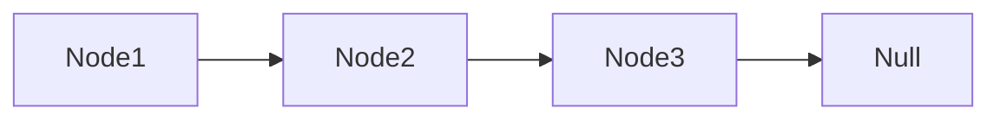
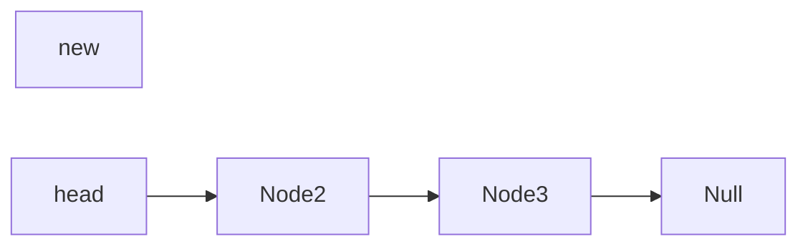
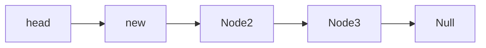

## 4.1 链表 Linked List

​	前面学习的栈和列表的动态结构的底层都是依托的静态数组，靠resize解决固定容量问题。而链表是真正的一种动态数据结构。而且是最简单的动态数据结构（和后面的树、二叉树、红黑树等相比）。

​	链表涉及到了更深入的引用问题（在C中就是所谓的指针）。对链表这种数据结构有深入的理解，有助于更好的理解引用、指针和==递归==等。递归机制对后面的树、图等的理解是很有用的。

​	树、图、栈、队列都可以用链表作为底层进行实现。

#### 4.1.1 链表结构

​	把数据存储到一个单独的结构中，称为 “节点” （Node）。

​	节点包括两部分内容：真正的数据和当前节点指向的下一个节点。节点数不可能是无尽的，所以最后一个next存储的节点就是Null。

```java
class Node {
    E e;
    Node next;
}
```



​	**优点**：

​	真正的动态，不需要处理固定容量的问题。

​	**缺点**：

​	丧失了随机访问的能力，也就是不能根据下标去直接访问某个元素。因为像数组那种在内存中开辟的存储空间是连续的，根据索引值和偏移量直接就能得到下面的元素。而链表的节点元素是通过next一个一个连接的，所以节点之间的存储不一定是连续的，而是在哪里都可以的。

## 4.2 链表实现

#### 4.2.1 添加元素

​	之前学习的数组、栈、队列都是从后端添加新元素容易实现，因为size一般指向下一个元素的位置，直接找到size对应位置赋值就好了。但是链表是==从头上==添加新元素容易实现，因为链表没有所谓的下标可以找到某个元素，所以要找到最后一个元素需要从第一个元素开始找直到最后一个元素！



在**头部**添加新的元素


```java
/**
 * 从头上添加新元素
 * @param e
 */
public void addFirst(E e){
    head = new Node(e, head);
    size ++;
}
```

在**中间**添加新的元素，比如在Node2前面添加新的元素。

​	这就需要找到新节点插入位置之前的节点是谁，定义prev指向前面的那个节点（Node1/head），前面节点的next指向新节点，新节点的next指向插入位置的原节点（Node2）。注意这个顺序是不可以变的！



​	但是还有一个**问题**：如果要在第一个位置那插入新元素时，是没有前一个元素的，这种情况下就需要特殊处理一下。

```java
/**
 * 从任意位置添加元素
 * @param index 插入位置是以0开始的，所以如果输入为0说明插入到头上，输入为2说明插入到第三个位置
 * @param e
 */
public void add(int index, E e){
    if(index < 0 || index > size){
        throw new IllegalArgumentException("Add Failed! Illegal index");
    }
    if(index == 0){
        addFirst(e);
    }else{
        //找到插入元素的前一个节点
        Node pre = head;
        for(int i = 0; i < index - 1; i ++){
            pre = pre.next;
        }
        pre.next = new Node(e, pre.next);
        size ++;
    }
}

/**
 * 从末尾添加元素
 * @param e
 */
public void addLast(E e){
    add(size, e);
}
```