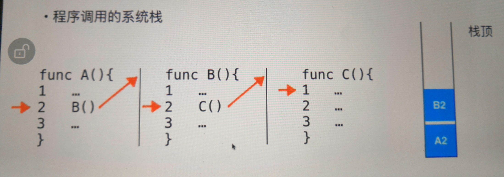
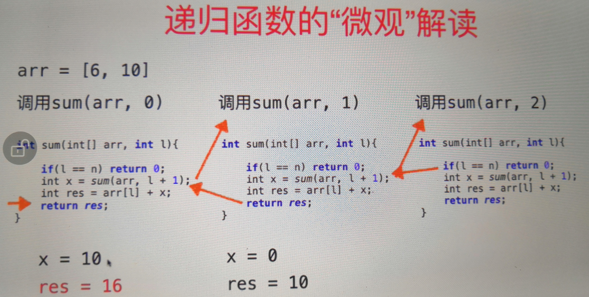
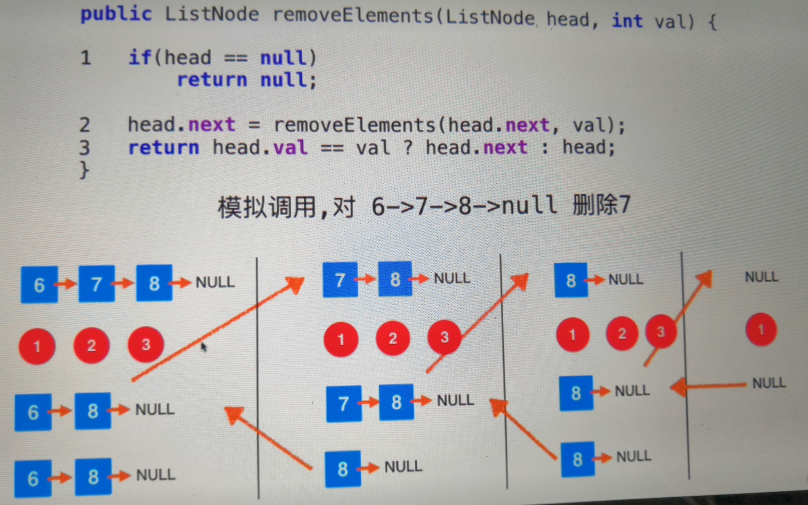
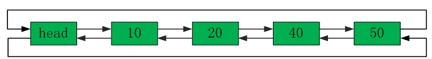

## 5.1 力扣中和链表相关的问题

#### 5.1.1 移除链表元素（简单）

##### 5.1.1.1 我的解答

```java
/**
 * Definition for singly-linked list.
 * public class ListNode {
 *     int val;
 *     ListNode next;
 *     ListNode(int x) { val = x; }
 * }
 */
class Solution {
    public ListNode removeElements(ListNode head, int val) {
        //先判断头结点
        while(head != null){
            if(head.val != val){ //头结点不需要删除，退出while循环
                break;
            }
            ListNode tempH = head;
            head = head.next;
            tempH = null;            
        }
        
        ListNode pre = head; //此时的head一定不等于val
        while(pre != null){ //再判断后面的结点
            if(pre.next == null){ //直接退出while循环
                break;
            }
            if(pre.next.val == val){
                 ListNode temp = pre.next;
                 pre.next = temp.next;
                 temp.next = null;
            }else{
                pre = pre.next;                
            }

        }            
        
        return head;
    }
}
```

执行用时 : 2 ms, 在Remove Linked List Elements的Java提交中击败了98.15% 的用户

内存消耗 : 42.8 MB, 在Remove Linked List Elements的Java提交中击败了69.24% 的用户

时间复杂度：链表长度

**出错点：**

​	while循环没弄清楚，条件判断也没弄清楚，提交了4遍才对。

##### 5.1.1.2 bobo老师

​	用虚拟头结点，我一开始也想到了这个思路，但是卡住了.....

​	注意最后的return，不能直接返回head，因为没有对head进行实质的操作，操作的是dummyHead（操作的pre，pre没有等于pre.next之前，是和dummyHead指向的同一区域），所以要返回dummyHead.next。

```java
/**
 * Definition for singly-linked list.
 * public class ListNode {
 *     int val;
 *     ListNode next;
 *     ListNode(int x) { val = x; }
 * }
 */
class Solution {
    public ListNode removeElements(ListNode head, int val) {
        //建立虚拟头结点
        ListNode dummyHead = new ListNode(-1);
        dummyHead.next = head;
        
        ListNode pre = dummyHead;
        while(pre.next != null){
            if(pre.next.val == val){
                ListNode temp = pre.next;
                pre.next = temp.next;
                temp.next = null;
            }else{
                pre = pre.next;
            }
        }
        return dummyHead.next;
    }
}
```

执行用时 : 2 ms, 在Remove Linked List Elements的Java提交中击败了98.15% 的用户

内存消耗 : 38.3 MB, 在Remove Linked List Elements的Java提交中击败了96.85% 的用户

时间复杂度：链表长度

#### 5.1.2 测试上一题中定义的链表类

```java
ListNode{
   ...
   ListNode cur = this; //此处的this就是指的链表的头结点
   ...
}	
```

## 5.2 递归基础与递归的宏观语义

#### 5.2.1 递归基础组成

​	求解最基本的问题

​	把原问题转化为更小的问题

```java
public class SumDiGui {
    /**
     * 数组求和运算
     * 用递归实现
     * sum { arr[0] + arr[1] + ... + arr[len-1] }
     * = arr[0] + sum { arr[1] + ... + arr[len-1] }
     *           = arr[1] + sum { arr[2] + ... + arr[len-1] }
     *                     = ...
     *                          = arr[len - 2] + sum { arr[len-1] }
     *                                         = arr[len - 1] + 0  
     *                                                      //递归结束，此时的sum返回值为0
     * @param args
     */
    public static void main(String[] args) {
        int[] arr = {2,3,4,5,6,7,8};
        System.out.println(sum(arr, 0));
    }

    public static int sum(int[] arr, int l){
        if(l == arr.length){ //求解最基本的问题： 可以理解为递归结束条件，也就是最小的问题情况
            return 0;
        }
        return arr[l] + sum(arr, l + 1); //把原问题转化为更小的问题
    }
}
```

#### 5.2.2 天然递归结构性质(用递归实现5.1算法题)

​	链表具有天然递归结构性质，一个链表可以看成，头结点后面挂了一个更短一点的链表，依次类比，就像上面的sum求和一样。

​	利用这种递归性质，解决5.1中的算法题，实现如下：

```java
/**
 * Definition for singly-linked list.
 * public class ListNode {
 *     int val;
 *     ListNode next;
 *     ListNode(int x) { val = x; }
 * }
 */
class Solution {
    public ListNode removeElements(ListNode head, int val) {
        if(head == null){ 
            return null;
        }
        ListNode res = removeElements(head.next, val);
        if(head.val == val){
            return res;
        }else{
            head.next = res;
            return head;
        }
    }
}
```

​	更简洁一点的实现，如下：

```java
class Solution {
    public ListNode removeElements(ListNode head, int val) {
        if(head == null){ //递归的结束条件，也是最基本的递归问题解
            return null;
        }
        head.next = removeElements(head.next, val); 
        return head.val == val ? head.next : head;
    }
}
```

## 5.3 递归函数的微观解读

​	递归调用是有代价的：函数调用+系统栈空间。







## 5.4 递归算法的调试

​	使用IDEA的debug或者用System打印输出。

## 5.5 更多和链表相关的话题

​	可以尝试实现双链表和循环链表。

​	斯坦福大学的十八个问题。<https://toutiao.io/posts/w4ynp6/preview> 

#### 5.5.1 链表和递归

​	因为链表可以看做是一个结点接着一个更短的链表的组合形式，所以，近乎和链表相关的所有操作，都可以使用递归的形式完成。

##### 5.5.1.1 增

​	自己实现的时候，递归结束的条件没弄对。递归结束就表示着问题已经不需要再继续更小的分解了。

```java
    /**
     * 从任意位置添加元素
     * @param index
     * @param e
     */
    public void add(int index, E e){
        if(index < 0 || index > size){
            throw new IllegalArgumentException("Add Fail, the index is wrong");
        }
        head = add(head, index, e);
        size ++;
    }

    /**
     * 任意位置添加元素的  递归实现
     * @param subHead
     * @param index
     * @param e
     * @return
     */
    private Node add(Node subHead, int index, E e){

        /**
         * 递归结束的判断
         */
        if(index == 0){
            return new Node(e, subHead);
        }

        subHead.next = add(subHead.next, index - 1, e);
        return subHead;
    }

    /**
     * 从头部添加元素
     * @param e
     * @return
     */
    public void addFirst(E e){
        add(0, e);
    }

    /**
     * 从尾部添加元素
     * @param e
     */
    public void addLast(E e){
        add(size, e);
    }
```

##### 5.5.1.2 删

​	实现删除时，返回值需要有两个，所以此处用到了Pair类。

​	删除指定位置的元素，实现：

```java
    /**
     * 从链表中删除指定元素
     * @param index
     * @return
     */
    public E remove(int index){
        if(index < 0 || index >= size){ //如果下标不合格
            throw new IllegalArgumentException("remove fail, the index is wrong");
        }
        if(isEmpty()){ //如果为空
            throw new  IllegalArgumentException("the linkedListByDiGui is empty, can't remove anyE");
        }
        Pair<Node, E> res = remove(head, index);
        head = res.getKey(); //要把最终的链表结果赋值过来
        size --;
        return res.getValue(); //返回得到的要删除的元素
    }

    private Pair<Node, E> remove(Node subHead, int index){
        /**
         * 递归结束的条件
         */
        if(index == 0){
            Node temp = subHead;
            subHead = temp.next;
            temp.next = null;
            return new Pair<>(subHead, temp.e);
            /**不考虑置空问题，就可以直接写为：
             * return new Pair<>(subHead.next, subHead.e);
             */
        }
        Pair<Node, E> res = remove(subHead.next, index - 1);
        subHead.next = res.getKey(); //连接上一段子链表
        return new Pair<>(subHead, res.getValue()); //此时传进去的还必须是递归结束时得到的那个value值
    }

    /**
     * 删除第一个元素
     * @return
     */
    public E removeFirst(){
        return remove(0);
    }

    /**
     * 删除最后一个元素
     * @return
     */
    public E removeLast(){
        return remove(size - 1);
    }
```

​	删除指定元素，实现：

```java
    /**
     * 删除指定元素
     * @param e
     * @return
     */
    public boolean removeE(E e){
        Pair<Node, Boolean> res = removeE(head, e);
        //head = res.getKey();
        return res.getValue();
    }

    private Pair<Node, Boolean> removeE(Node subHead, E e){
        /**
         * 递归结束条件
         */
        if(subHead == null){ //到最后也没找到指定元素
            return new Pair<>(null, false);
        }
        Pair<Node, Boolean> res = removeE(subHead.next, e);
        subHead.next = res.getKey();

        if(subHead.e.equals(e)){ //找到指定元素，执行删除
            size --;
            return new Pair<>(subHead.next, true);
        }else{
            return new Pair<>(subHead, res.getValue());
        }

    }
```

##### 5.5.1.3 查

​	不多不少元素，不能考虑连接一段段的子链表，只需要找到具体结点就好了。

```java
    /**
     * 得到指定位置的元素
     * @param index
     * @return
     */
    public Node getNode(int index){
        if(index < 0 || index >= size){
            throw new  IllegalArgumentException("getNode is failed, the index is wrong");
        }
        if(isEmpty()){ //如果为空
            throw new IllegalArgumentException("the linkedListByDiGui is empty, can't getAnyNode");
        }
        return getNode(head, index);
    }

    /**
     * 得到指定位置元素的  递归实现
     * @param subHead
     * @param index
     * @return
     */
    private Node getNode(Node subHead, int index){
        /**
         * 递归结束的条件
         */
        if(index == 0){
            return subHead;
        }
        return getNode(subHead.next, index - 1);
    }
```

​	判断是否包含某元素。

```java
    /**
     * 判断是否包含某元素
     * @param e
     * @return
     */
    public boolean contain(E e){
        return contain(head, e);
    }

    private boolean contain(Node subHead, E e){
        if(subHead == null){ //一直到最后一个也没找到
            return false;
        }else if(subHead.e.equals(e)){
            return true;
        }
        return contain(subHead.next, e);
    }
```

##### 5.5.1.4 改

​	对于没有返回值的递归方法，在递归结束位置写return，就是直接结束递归，得到结果了。

```java
    /**
     * 修改某结点元素
     * @param index
     * @param e
     */
    public void setNode(int index, E e){
        if(index < 0 || index >= size){
            throw new  IllegalArgumentException("setNode is failed, the index is wrong");
        }
        if(isEmpty()){ //如果为空
            throw new IllegalArgumentException("the linkedListByDiGui is empty, can't setAnyNode");
        }
        setNode(head, index, e);
    }

    /**
     * 修改某结点元素  的递归实现
     * @param subHead
     * @param index
     * @param e
     * @return
     */
    private void setNode(Node subHead, int index, E e){
        /**
         * 递归结束的条件
         */
        if(index == 0){
            subHead.e = e;
            return;
        }
        setNode(subHead.next, index - 1, e);
    }
```

#### 5.5.2 双链表

​	双链表的实现：

```java
/**
 * 双链表
 * @param <E>
 */
public class SLinkedList<E> implements LinkedListInte<E>{

    private class Node{
        E e;
        Node pre, next;

        Node(E e){
            this.e = e;
        }

        Node(Node pre, Node next){
            this.pre = pre;
            this.next = next;
        }

        Node(Node pre, E e, Node next){
            this(e);
            this.pre = pre;
            this.next = next;
        }

        @Override
        public String toString(){
            return (e == null || this == null) ? null : e.toString();
        }
    }

    Node head;
    Node tail;
    int size;

    SLinkedList(){
        head = null;
        tail = null;
        size = 0;
    }

    @Override
    public int getSize() {
        return size;
    }

    @Override
    public boolean isEmpty() {
        return size == 0;
    }

    /**
     * 得到指定元素
     * @param index
     * @return
     */
    public Node get(int index){
        if(index < 0 || index >= size){
            throw new IllegalArgumentException("get is failed, the index is illegal");
        }
        if(index < (size >>> 1)){
            Node res = head;
            for(int i = 0; i < index; i ++){
                res = res.next;
            }
            return res;
        }else{
            Node res = tail;
            for(int i = (size - 1); i > index; i --){
                res = res.pre;
            }
            return res;
        }
    }

    /**
     * 添加
     * @param index 插入位置是以0开始的，所以如果输入为0说明插入到头上，输入为2说明插入到第三个位置
     * @param e
     */
    @Override
    public void add(int index, E e) {
        if(index < 0 || index > size){
            throw new IllegalArgumentException("add is failed, the index is illegal");
        }
        if(index == size){ //空或尾部添加
            Node newNode = new Node(null, e, null);
            if(index == 0){
                head = newNode;
            }else{
                newNode.pre = tail;
                tail.next = newNode;
            }
            tail = newNode;
        }else{
            Node cur = get(index);
            Node newNode = new Node(cur.pre, e, cur);
            if(cur.pre == null){ //cur是头结点
                head = newNode;
            }else{
                cur.pre.next = newNode;
            }
            cur.pre = newNode;
        }
        size ++;
    }

    public void addFirst(E e){
        add(0, e);
    }
    public void addLast(E e){
        add(size, e);
    }

    @Override
    public E getE(int index) {
        return get(index).e;
    }

    @Override
    public void setE(int index, E e) {
        get(index).e = e;
    }

    @Override
    public boolean contain(E e) {
        if(isEmpty()){
            throw new IllegalArgumentException("contain is failed, the linkedList is empty");
        }
        Node cur = head;
        for(int i = 0; i < size; i ++){
            if(cur.e.equals(e)){
                return true;
            }
            cur = cur.next;
        }
        return false;
    }

    @Override
    public E remove(int index) {
        if(index < 0 || index >= size){
            throw new IllegalArgumentException("remove is failed, the index is illegal");
        }

        Node cur = get(index);
        if(cur.pre == null){ //删除头结点
            cur.next.pre = null;
            head = cur.next;
        }else if(cur.next == null){ //删除尾结点
            cur.pre.next = null;
            tail = cur.pre;
        }else{
            cur.next.pre = cur.pre; //删尾不需要这个
            cur.pre.next = cur.next; //删头不需要这个
        }
        size --;
        return cur.e;
    }

    public E removeFirst(){
        return remove(0);
    }
    public E removeLast(){
        return remove(size - 1);
    }
}

```

#### 5.5.3 循环双链表

​	Java的LinkedList类的底层实现就是用的循环双链表。

​	链表实现的样子如下：（head应该改为dummyHead，是虚拟头结点，不存数据）



```java
/**
 * 循环双链表 参考 https://blog.csdn.net/u014039577/article/details/50386690
 */
public class XHSLinkedList<E> implements LinkedListInte<E>{

    /**
     * 结点内部类
     */
    private class Node{
        public E e;
        public Node pre;
        public Node next;

        /**
         * 构造器
         */
        Node(E e){
            this.e = e;
        }
        Node(Node pre, Node next){
            this.pre = pre;
            this.next = next;
        }
        Node(Node pre, E e, Node next){
            this(e);
            this.pre = pre;
            this.next = next;
        }

        @Override
        public String toString(){
            return e == null ? null : e.toString();
        }
    }

    Node dummyHead; //虚拟头结点
    int size ;

    XHSLinkedList(){
        dummyHead = new Node(null, null, null);
        size = 0;
    }

    @Override
    public int getSize() {
        return size;
    }

    @Override
    public boolean isEmpty() {
        return size == 0;
    }

    /**
     * 得到某结点
     * 因为既可以从后往前找，又可以从前往后找
     * 所以，index < size/2 时，从前往后找；另一种情况下，从后往前找
     * @param index
     * @return
     */
    public Node get(int index){
        if(index < 0 || index >= size){
            throw new IllegalArgumentException("get failed! index is wrong");
        }
        Node node = dummyHead;
        if(index < (size >>> 1)){
            for(int i = 0; i <= index; i ++){
                node = node.next;
            }
        }else{
            for(int i = (size - 1); i >= index; i --){
                node = node.pre;
            }
        }
        return node;
    }

    /**
     * 添加
     * @param index 插入位置是以0开始的，所以如果输入为0说明插入到头上，输入为2说明插入到第三个位置
     * @param e
     */
    @Override
    public void add(int index, E e) {
        if(index < 0 || index > size){
            throw new IllegalArgumentException("add failed! index is wrong");
        }
        Node preNode = null;
        Node nextNode = null;
        if(index == size){ //0 == size 是空的时候，size!=0 则是在链表尾部直接加
            preNode = index == 0 ? dummyHead : get(size - 1);
            nextNode = dummyHead;
        }else{
            /**
             *  此时的get(index)一定不为空
             *  因为为空，即空链表，也就是index = 0 = (size:0)的时候，是前面if里面做的事
             */
            preNode = get(index).pre;
            nextNode = preNode.next;
        }
        Node newNode = new Node(preNode, e, nextNode);
        nextNode.pre = newNode;
        preNode.next = newNode;
        size ++;
    }

    public void addFirst(E e) {
        add(0, e);
    }
    public void addLast(E e) {
        add(size, e);
    }

    @Override
    public E getE(int index) {
        return get(index).e;
    }

    public E getFirst() {
        return getE(0);
    }
    public E getLast() {
        return getE(size - 1);
    }

    @Override
    public void setE(int index, E e) {
        Node cur = get(index);
        cur.e = e;
    }

    @Override
    public boolean contain(E e) {
        if(isEmpty()){
            throw new  IllegalArgumentException("the linkedList is empty!");
        }
        Node cur = dummyHead.next;
        for(int i = 0; i < size; i ++){
            if(cur.e.equals(e)){
                return true;
            }
            cur = cur.next;
        }
        return false;
    }

    /**
     * 删除
     * @param index
     * @return
     */
    @Override
    public E remove(int index) {
        if(isEmpty()){
            throw new IllegalArgumentException("the linkedList is empty, can't remove");
        }
        Node res = get(index); //得到要删除的元素
        res.pre.next = res.next;
        res.next.pre = res.pre;
        size --;
        return res.e;
    }

    public E removeFirst() {
        return remove(0);
    }
    public E removeLast() {
        return remove(size - 1);
    }
```

#### 5.5.4 数组链表

​	知道链表的结点有多少个定义数组大小，或者把数组大小定义为Integer的最大值。

